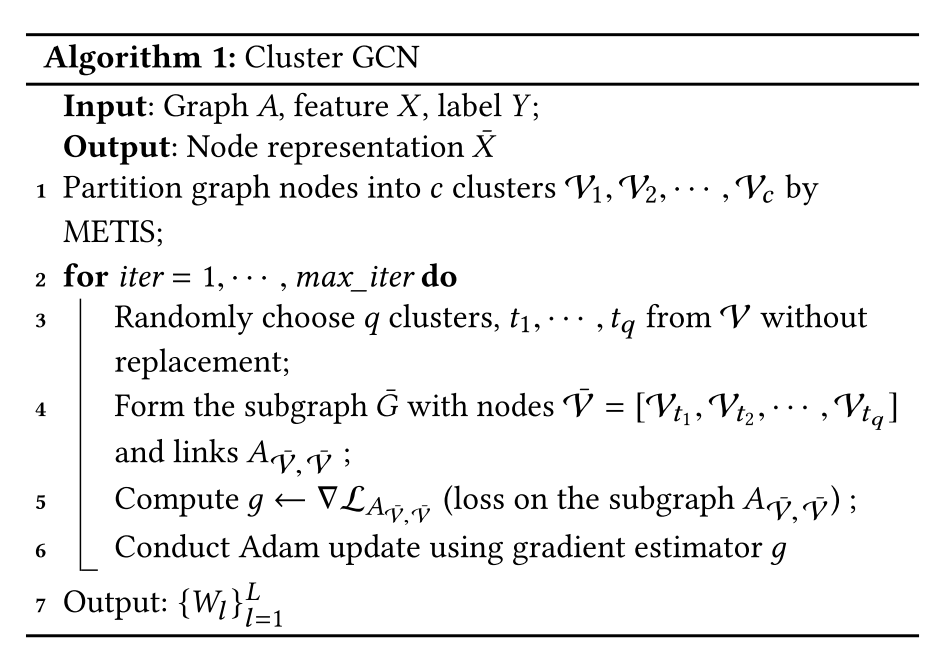

# 超大图上的节点表征学习  

## 问题

对于一个超大图进行图节点表征学习，保存整张图的信息以及每一层每一个节点的表征信息需要消耗巨大的内存空间。

## 核心思想

类似于Mini-Batch SGD，每次选取一些节点构造子图来进行训练。

- 随机选取节点：可能丢失很多簇间的边信息，子图信息损失较大。
- 利用图节点聚类算法，将一张图划分成k个簇，每次随机选取多个簇组成一个batch进行训练。（Cluster-GCN）

伪代码如下：



## 实践

**输入数据**

```python
import torch
import torch.nn.functional as F
from torch.nn import ModuleList
from tqdm import tqdm
from torch_geometric.datasets import Reddit, Reddit2
from torch_geometric.data import ClusterData, ClusterLoader, NeighborSampler
from torch_geometric.nn import SAGEConv

dataset = Reddit('graph/dataset/Reddit')
data = dataset[0]
```

**构造簇类数据，生成加载器**

```python
cluster_data = ClusterData(data, num_parts=1500, recursive=False,
                           save_dir=dataset.processed_dir)
train_loader = ClusterLoader(cluster_data, batch_size=20, shuffle=True,
                             num_workers=12)

subgraph_loader = NeighborSampler(data.edge_index, sizes=[-1], batch_size=1024,
                                  shuffle=False, num_workers=12)
```

num_parts指簇类个数。

**构造网络**

```python
class Net(torch.nn.Module):
    def __init__(self, in_channels, out_channels):
        super(Net, self).__init__()
        self.convs = ModuleList(
            [SAGEConv(in_channels, 128),
             SAGEConv(128, out_channels)])

    def forward(self, x, edge_index):
        for i, conv in enumerate(self.convs):
            x = conv(x, edge_index)
            if i != len(self.convs) - 1:
                x = F.relu(x)
                x = F.dropout(x, p=0.5, training=self.training)
        return F.log_softmax(x, dim=-1)

    def inference(self, x_all):
        pbar = tqdm(total=x_all.size(0) * len(self.convs))
        pbar.set_description('Evaluating')

        # Compute representations of nodes layer by layer, using *all*
        # available edges. This leads to faster computation in contrast to
        # immediately computing the final representations of each batch.
        for i, conv in enumerate(self.convs):
            xs = []
            for batch_size, n_id, adj in subgraph_loader:
                edge_index, _, size = adj.to(device)
                x = x_all[n_id].to(device)
                x_target = x[:size[1]]
                x = conv((x, x_target), edge_index)
                if i != len(self.convs) - 1:
                    x = F.relu(x)
                xs.append(x.cpu())

                pbar.update(batch_size)

            x_all = torch.cat(xs, dim=0)

        pbar.close()

        return x_all
```

相比之前的图神经网络多了inference推理方法。inference方法应用于推理阶段，为了获取更高的预测精度，所以使用subgraph_loader。

**训练及测试**

```python
device = torch.device('cuda' if torch.cuda.is_available() else 'cpu')
model = Net(dataset.num_features, dataset.num_classes).to(device)
optimizer = torch.optim.Adam(model.parameters(), lr=0.005)


def train():
    model.train()

    total_loss = total_nodes = 0
    for batch in train_loader:
        batch = batch.to(device)
        optimizer.zero_grad()
        out = model(batch.x, batch.edge_index)
        loss = F.nll_loss(out[batch.train_mask], batch.y[batch.train_mask])
        loss.backward()
        optimizer.step()

        nodes = batch.train_mask.sum().item()
        total_loss += loss.item() * nodes
        total_nodes += nodes

    return total_loss / total_nodes


@torch.no_grad()
def test():  # Inference should be performed on the full graph.
    model.eval()

    out = model.inference(data.x)
    y_pred = out.argmax(dim=-1)

    accs = []
    for mask in [data.train_mask, data.val_mask, data.test_mask]:
        correct = y_pred[mask].eq(data.y[mask]).sum().item()
        accs.append(correct / mask.sum().item())
    return accs


for epoch in range(1, 31):
    loss = train()
    if epoch % 5 == 0:
        train_acc, val_acc, test_acc = test()
        print(f'Epoch: {epoch:02d}, Loss: {loss:.4f}, Train: {train_acc:.4f}, '
              f'Val: {val_acc:.4f}, test: {test_acc:.4f}')
    else:
        print(f'Epoch: {epoch:02d}, Loss: {loss:.4f}')
```

